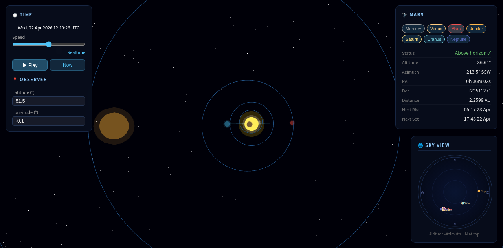

# Project Solar

A real-time solar system viewer built with Three.js and accurate Keplerian orbital mechanics. Enter your location and see exactly where every planet is in the sky — right now, or at any point in history or the future.



## Features

### Orbital Simulation
- All 8 planets rendered using JPL Keplerian orbital elements (J2000.0 epoch)
- Accurate heliocentric positions computed via Kepler's equation
- Ecliptic → equatorial coordinate conversion
- Saturn's rings

### Time Control
- Runs at realtime by default — the planets actually move
- Speed slider spanning 15 steps from **100 years/second backward** to **100 years/second forward**:
  `100yr ← 10yr ← 1yr ← 30d ← 7d ← 1d ← 1hr ← Realtime → 1hr → 1d → 7d → 30d → 1yr → 10yr → 100yr`
- **Now** button snaps back to the present

### Observer Location
- Set your latitude and longitude to get ground-truth altitude/azimuth
- Defaults to London (51.5°N, 0.1°W)

### Planet Info Panel
Select any planet to see:
- Above/below horizon status
- Altitude and azimuth (compass direction)
- Right ascension and declination (J2000)
- Distance in AU
- Next rise and set times


### Sky View Compass
A real-time altitude–azimuth projection in the bottom-right showing all visible planets above the horizon, colour-coded by planet.

### Visual Rendering
- Planets scaled for visibility (not true to scale) — gas giants are large, inner planets clearly distinct
- Emissive glow on all planet materials so they're readable against black space
- Atmospheric halo around each planet (transparent glow sphere)
- Layered sun corona with two glow radii
- Bright blue orbit lines at 75% opacity
- Saturn's rings scale with planet radius

## Files

| File | Purpose |
|---|---|
| `index.html` | Main app — Three.js scene, UI, animation loop |
| `elements.js` | JPL Keplerian orbital elements for all 8 planets |
| `kepler.js` | Orbital mechanics — heliocentric position, ecliptic→equatorial |
| `astronomy.js` | Julian date, alt/az, RA/Dec formatting |
| `horizon.js` | Rise/set computation, visibility for observer location |

## Running

No build step. Just serve the directory over HTTP:

```bash
python3 -m http.server 8000
```

Then open `http://localhost:8000`.

## Data Source

Orbital elements from [JPL Solar System Dynamics — Keplerian Elements for Approximate Positions of the Major Planets](https://ssd.jpl.nasa.gov/planets/approx_pos.html).
